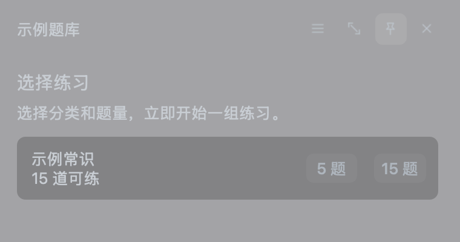

<div align="center">
  
  <h1>小窗刷题 · QuizPane</h1>
  <p><strong>工作空档做两道，题目放在桌角，想收就收。</strong></p>
  <p>轻巧刷题 · 一键收起 · 接着上次继续做</p>
  <p>
    <a href="https://github.com/tianyoudoge/quizpane/stargazers"></a>
    <a href="https://github.com/tianyoudoge/quizpane/forks"></a>
    <a href="https://github.com/tianyoudoge/quizpane/releases/latest"></a>
    <a href="https://github.com/tianyoudoge/quizpane/actions/workflows/release.yml"></a>
    <a href="LICENSE"></a>
  </p>
  <p>
    <a href="https://github.com/tianyoudoge/quizpane/releases/latest">下载最新版</a> ·
    <a href="#三分钟开始刷题">开始使用</a> ·
    <a href="#已实现与正在完善">已实现与计划</a> ·
    <a href="#developer-guide">Developer Guide</a>
  </p>
</div>

---

## 把刷题放到空档里

工作时总会有几分钟：等消息、等会议、等编译、摸一会儿鱼。小窗刷题不想占掉你的桌面，只把一套题放在角落里。做一题、看一眼解析，然后继续干活；需要收起来时，按一下快捷键就行。

它不替你许愿“轻松上岸”，只想帮你把那些零碎时间攒成真正的练习量。

<div align="center">
  
  <p><sub>导入题库后，选一个分类和题量，就能开始。</sub></p>
</div>

## 现在就能用什么？

| 你想做的事 | 小窗刷题现在的表现 |
|---|---|
| 利用空档刷几题 | 在桌面角落打开题目；选完答案可自动进入下一题 |
| 有人来了先收起来 | 默认按 <kbd>Ctrl</kbd> + <kbd>Shift</kbd> + <kbd>H</kbd> 隐藏，再按一次回来 |
| 题目太长看不全 | 直接滚动题目内容，翻题和交卷按钮始终在手边 |
| 下班前没做完 | 答案会自动保存，下次打开可以继续 |
| 换一套题或换个方向 | 可以安装、切换、删除多个题库 |
| 做完想知道哪里错了 | 交卷后逐题看自己的答案、正确答案和解析 |
| 自己手里有资料 | 可用“题库制作器”把 TXT、Markdown、Word、PDF 整理成可导入题库 |

小窗可以拖到顺手的位置，也可以选小、中、大三种大小。它不会替你抢走整个屏幕。

## 三分钟开始刷题

### 1. 下载“小窗刷题”

到 [最新版 Releases](https://github.com/tianyoudoge/quizpane/releases/latest) 下载与你的电脑对应的文件：

| 你的电脑 | 选择的文件 |
|---|---|
| Mac（M1/M2/M3/M4） | `QuizPane-macos-arm64.dmg` |
| Intel Mac | `QuizPane-macos-x86_64.dmg` |
| Windows 10/11 64 位 | `QuizPane-windows-x64.exe` |
| Linux、统信 UOS、银河麒麟 x64 | `QuizPane-linux-x86_64.deb`；也可选 `.tar.gz` / `.tar.xz` |

Mac 打开 DMG 后把应用拖进“应用程序”；Windows 运行安装程序；Linux 优先安装 `.deb`，也可完整解压后运行 `QuizPane.AppDir/AppRun`。不要只把压缩包里的单个程序文件拖出来运行。

> Windows 7、Linux ARM64、macOS 10.14/10.15 还没有可用版本。统信 UOS、银河麒麟目前是 Linux x64 兼容构建，尚未完成官方认证和真机验收。

### 2. 装一份题库

题库文件的后缀是 `.quizpane-provider`。拿到文件后任选一种方式：

1. 点右上角三横线 → **题库管理** → **添加题库…**；
2. 直接把题库文件拖到小窗上。

装好后选题目分类和题量，点击开始。做完交卷，就能看解析。

目前请只导入来源可信、内容有合法授权的题库文件。公开仓库不附带任何未经授权的商业题库或登录协议。

### 3. 有自己的资料？打开“题库制作器”

不想自己写代码，也可以把自己的 TXT、Markdown、Word 或 PDF 资料整理成题库。在小窗刷题菜单中选择“制作自己的题库”，按向导添加资料；题目与答案分在两个文件时可以配对添加。完成后题库会自动添加到小窗刷题。

## 用起来顺手的小细节

- 做完一道单选题会自动进入下一题；要改答案时，手动回到上一题即可。
- 题目和解析用不同的颜色显示，交卷后更容易扫到重点。
- 点标题栏的图钉，可以让题目一直留在最上面；不需要时再点一下关闭。
- 老板键可以在“三横线 → 老板键设置…”里改掉。默认是 `Ctrl + Shift + H`。
- 关闭软件不等于丢进度；草稿会保留。需要登录的题库也会分别保留自己的登录状态。

## 已实现与正在完善

### 已经可以使用

- 小窗答题：选题、做题、交卷、逐题看解析；
- 自动保存草稿，支持恢复未完成练习；
- 题库的添加、切换、删除和拖入安装；
- 一键隐藏、系统托盘、Mac 菜单、三档大小和固定在屏幕前面；
- 本地示例题库，以及从文本、Word、PDF 整理题库的制作器；
- Windows 10/11 x64、Apple Silicon Mac、Intel Mac、Linux x64 的构建产物。

### 正在完善，暂不承诺可用

- 题库市场和一键找题库；
- 首批经授权的在线题库及扫码登录接入；
- 更多资料格式：CSV、JSON、QTI；
- 统信 UOS、银河麒麟的真机验收，Linux ARM64、Windows 7、旧版 macOS 支持；
- 题库签名、来源审核、投诉和下架机制。

## 常见问题

### 为什么打开后没有题？

小窗刷题不自带商业题库。先安装一份可信的题库文件，或用题库制作器做自己的题库。

### 关闭以后，答案和登录会丢吗？

不会。未完成的练习会保存；不同题库的登录信息也会分开保存。删除题库时默认仍保留这些数据，彻底清除数据的入口还在完善。

### Mac 提示无法打开怎么办？

请先确认文件来自本仓库 Release，并核对同页面的 SHA-256。当前 Mac 包尚未完成 Apple Developer ID 公证，第一次可右键应用选择“打开”；不要为了运行一个应用而关闭整台电脑的安全保护。

### 这是完全免费的开源软件吗？

个人和符合许可定义的非商业使用免费。源码公开可读；商业使用需要单独授权，详见 [LICENSE](LICENSE)。

---

<a id="developer-guide"></a>

# 开发者文档

普通用户读到这里就够了。下面是源码构建、Provider 开发和平台贡献说明。

第一次接触 C++/Qt，建议先阅读面向 Java Web 开发者的
[`架构与 Code Review 导读`](docs/架构与Provider开发导读.md)，再从窗口源码开始审查。

## 工程结构

```text
quizpane/
├── apps/desktop-qt/       # Qt Widgets 桌面 Host
├── apps/bank-studio/      # 独立题库制作器（历史内部目录名）
├── core/                  # 答题、草稿和图片处理领域逻辑
├── sdk/                   # Provider ABI、加载器和安装器
├── providers/demo/        # 完全离线的示例题库
├── tools/bank-generator/  # 本地题库生成器（开发中）
├── tests/                 # 自动测试
├── packaging/             # 平台打包资源
├── scripts/               # macOS/Windows/Linux 构建脚本
└── docs/                  # 架构与构建文档
```

需要 CMake 3.24+、Ninja、C++20 编译器和 Qt 6.5+，包含 Core、Widgets、Network、Core5Compat 与 Pdf。
二维码和 ZIP 依赖由 CMake FetchContent 自动拉取，不需要手工复制第三方源码。

## macOS 开发构建

```bash
brew install cmake ninja qt qt5compat tesseract tesseract-lang
git clone git@github.com:tianyoudoge/quizpane.git
cd quizpane
export CMAKE_PREFIX_PATH="$(brew --prefix qt);$(brew --prefix qt5compat)"
cmake --preset dev
cmake --build --preset dev
ctest --preset dev
```

默认构建和官方发行包均启用 Tesseract C++ OCR；发行包同时携带 `chi_sim`、
`eng` 语言数据，不依赖 Python、外部脚本或用户另行安装运行库。自行构建时需先
安装 Tesseract 开发库和这两份语言数据；只有明确需要精简体积时才配置
`-DQUIZPANE_ENABLE_TESSERACT_OCR=OFF`。

## 本地诊断包与日志

官方 Release 默认不启用文件诊断日志，也不携带调试符号。本地需要排查崩溃或
非预期行为时，使用 DEBUG 打包开关；产物文件名会附加 `-debug`：

```bash
# macOS
DEBUG_BUILD=1 ./scripts/build-macos.sh

# Linux / UOS / 银河麒麟
DEBUG_BUILD=1 ./scripts/build-uos.sh
```

```powershell
# Windows
.\scripts\build-windows.ps1 -QtRoot C:\Qt\6.8.0\msvc2022_64 -DebugBuild
```

也可直接给 CMake 配置 `-DQUIZPANE_ENABLE_DIAGNOSTIC_LOGGING=ON`。DEBUG 包使用
`RelWithDebInfo`，保留符号并写入最多三份日志（当前文件及 `.1`、`.2`，每份
5 MiB）。默认只记录文件名、Provider/任务 ID、阶段、数量、耗时、HTTP 状态、
错误和崩溃栈，日常通常只有几十到几百 KiB。

只有需要排查解析或模型输出时才开启详细载荷：macOS/Linux 使用
`DEBUG_BUILD=1 VERBOSE_LOGS=1`，Windows 追加 `-DebugBuild -VerboseLogs`。
此时每份提取文本和模型响应最多记录 64 KiB、最终候选题库最多 128 KiB。
API Key、Authorization 和 Token 始终自动脱敏。

| 平台 | 日志目录 |
|---|---|
| macOS | `~/Library/Application Support/QuizPane/logs/` |
| Windows | `%LOCALAPPDATA%\QuizPane\logs\` |
| Linux/UOS/麒麟 | `${XDG_DATA_HOME:-~/.local/share}/QuizPane/logs/` |

主程序日志名为 `quizpane-debug.log`，题库制作器为
`question-maker-debug.log`。正常退出时最后一行包含 `session end exit=clean`；
缺少该标记通常意味着进程崩溃、被强制结束或被系统杀掉。

DEBUG 菜单中会出现“查看调试日志…”。macOS/Linux 的致命信号堆栈分别写到
`quizpane-crash.log`、`question-maker-crash.log`，最多记录 128 帧；Windows
对应生成 `quizpane-crash.dmp`、`question-maker-crash.dmp`，可用 DEBUG 包内
的 PDB 在 Visual Studio 或 WinDbg 中查看完整线程和调用栈。Release 不安装这些
处理器，也不生成上述文件。

运行公开 Demo Provider：

```bash
./build/dev/apps/desktop-qt/小窗刷题.app/Contents/MacOS/小窗刷题 \
  --provider ./build/dev/providers/demo/libquizpane_provider_demo.dylib
```

生成 macOS 发布包：

```bash
./scripts/build-macos.sh
```

## Windows 10/11 构建

在 Visual Studio 2022 x64 Developer Prompt 中：

```powershell
git clone git@github.com:tianyoudoge/quizpane.git
cd quizpane
.\scripts\build-windows.ps1 -QtRoot C:\Qt\6.8.0\msvc2022_64
```

Windows 7 不使用当前 Qt 6 主线，需要单独的 Qt 5.15 兼容分支。

## UOS 与银河麒麟构建

```bash
sudo apt install build-essential cmake ninja-build pkg-config \
  qt6-base-dev qt6-base-private-dev libx11-dev libsecret-1-dev
```

UOS：

```bash
./scripts/build-uos.sh
```

银河麒麟：

```bash
DISTRO_ID=kylin DIST_DIR="$PWD/dist/kylin" ./scripts/build-uos.sh
```

Linux 可以共用较老的 ABI 构建基线，但 x86_64、ARM64 必须分别编译，并在每一个声明支持的目标系统上真机验收。详细说明见 [`docs/题库管理与跨平台构建打包指南.md`](docs/题库管理与跨平台构建打包指南.md)。

## Provider 开发

Provider 使用稳定 C ABI，Host 与 Provider 通过 UTF-8 JSON RPC 交互。最小实现参考 [`providers/demo`](providers/demo) 和 [`docs/架构与Provider开发导读.md`](docs/架构与Provider开发导读.md)。

公开 Provider 必须：

- 拥有接口、题目、图片和解析的必要授权；
- 声明网络、安全凭据和本地文件权限；
- 不读取其他 Provider 的凭据；
- 不包含 Cookie、Token、抓包或无授权内容；
- 分别为目标操作系统和 CPU 架构构建。

## 题库制作器（开发中）

当前可以校验题库源 JSON：

```bash
cmake -S . -B build/dev -G Ninja \
  -DCMAKE_PREFIX_PATH=/path/to/Qt \
  -DQUIZPANE_BUILD_BANK_GENERATOR=ON
cmake --build build/dev --target quizpane-bank-generator
./build/dev/tools/bank-generator/quizpane-bank-generator \
  --validate tools/bank-generator/examples/example-bank.json
```

CSV/QTI 导入、`.quizpane-bank` 分块压缩、签名、加密和图形化向导仍在开发。

## 参与平台构建

我们需要 Intel macOS、Windows 10/11、统信 UOS 和银河麒麟用户帮助构建。提交产物时必须同时提供：

- 对应 Git commit；
- 操作系统、CPU、编译器、Qt 和系统库版本；
- 完整构建命令与测试输出；
- 干净系统启动验收结果；
- SHA-256。

维护者不会直接发布来源不明的二进制。完整流程见 [`CONTRIBUTING.md`](CONTRIBUTING.md)，安全问题见 [`SECURITY.md`](SECURITY.md)。

## English

QuizPane is a compact, native desktop quiz window designed to stay in a corner instead of taking over the screen. It supports translucent always-on-top UI, a global hide/show hotkey, draft recovery, multiple question-bank Providers, submission, and per-question explanations.

### Install

Each `QuizPane-*` download includes both the floating quiz client and Question Maker. Choose `macos-arm64` for Apple Silicon, `macos-x86_64` for Intel Macs, `windows-x64` for 64-bit Windows 10/11, or `linux-x86_64` for Linux/UOS/Kylin. Question Maker adds finished local banks directly to QuizPane. Windows 7, Linux ARM64, and macOS 10.14/10.15 are not supported by the current release.

The current build is an unnotarized technical preview. Verify the SHA-256 published with the release and do not disable Gatekeeper globally.

### Use

1. Add a trusted question-bank Provider;
2. choose a category and question count;
3. answer questions in the floating window;
4. submit the attempt;
5. review the correct answer and explanation;
6. press `Ctrl+Shift+H` to hide or restore the window globally.

### Build

```bash
cmake --preset dev
cmake --build --preset dev
ctest --preset dev
```

See the Chinese developer sections above, [`CONTRIBUTING.md`](CONTRIBUTING.md), and [`docs/题库管理与跨平台构建打包指南.md`](docs/题库管理与跨平台构建打包指南.md) for full platform instructions.

## 许可证 / License

QuizPane 使用 [PolyForm Noncommercial License 1.0.0](LICENSE)。个人及符合定义的非商业用途免费；广告版、企业集成、收费发行和其他商业用途需要书面授权。联系 **xutianyoubupt@foxmail.com**，详见 [`COMMERCIAL_LICENSE.md`](COMMERCIAL_LICENSE.md)。

QuizPane is licensed under the [PolyForm Noncommercial License 1.0.0](LICENSE). Qualifying personal and noncommercial use is free. Commercial use requires a separate written license; see [`COMMERCIAL_LICENSE.md`](COMMERCIAL_LICENSE.md).

Third-party dependencies retain their own licenses. The QR encoder is based on Project Nayuki's MIT-licensed QR Code generator.
